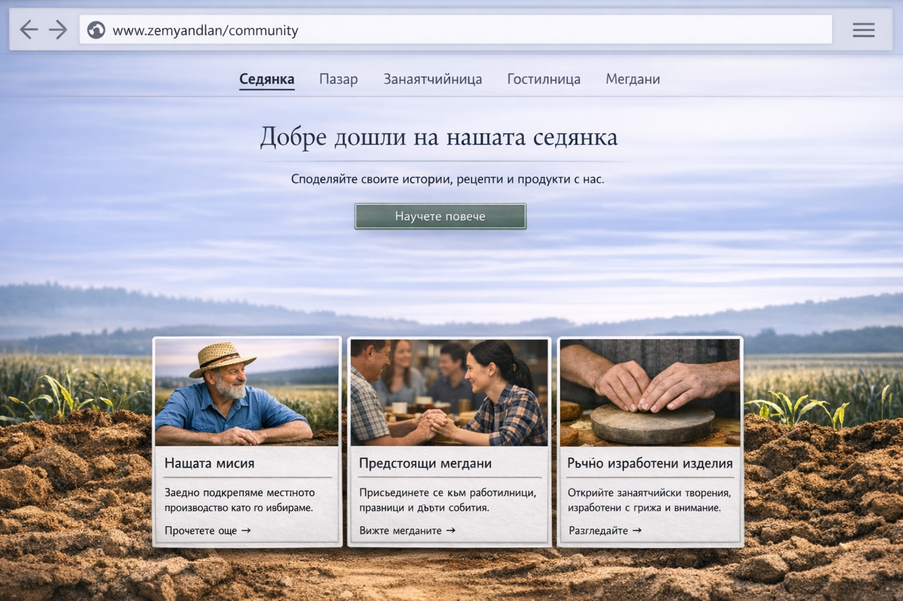

# zemyanadlan-backend

Spring Boot backend for **zemyanadlan.bg** platform. 

Zemyanadlan is a community-first platform that connects local producers, artisans, and communities.
The platform supports community posts and multiple listing domains (Market, Crafts, Places, Events), providing a clean scalable backend API build with Spring Boot, JPA, and REST principles.

## Key Features
- **Community**: posts with comments and counters.
- **MarketPlace listings**: products with categories, filters and pagination.
- **Crafts listings**: crafts with categories, filters and pagination.
- **Places listings**: to do 
- **Events listings**: to do
- **Categories**: centralized management of categories across all listing types.

